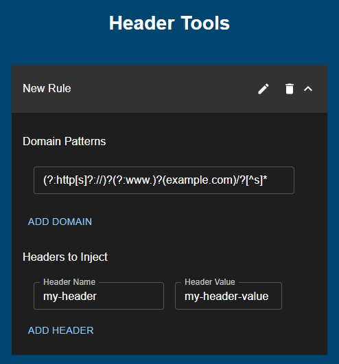

    

# HeaderTools

 
## Overview
HeaderTools is a versatile and user-friendly Chrome extension designed to provide users the capability to define unique browsing rules. These rules can be a combination of titles, domain regular expressions (regex), and headers to be injected for each request matching the defined domain regex.

This was largely created as a replacement for ModHeader due to the author's decision to include Adware in a recent update.

    

 
## Features
* Title Setting: Define unique titles for your browsing rules.
* Domain Matching: Utilize regular expressions (regex) to create rules for specific domains or patterns.
* HTTP Header Injection: Easily modify and inject HTTP headers for requests matching a certain rule.
* User-friendly Interface: The interface is designed to be intuitive and user-friendly, simplifying the process of creating and managing your rules.
 
## How to Use
* Install the Extension: Add HeaderTools to your Chrome browser using the latest release from the releases page.
* Open the Extension: Click on the HeaderTools icon in your browser's toolbar.
* Create a Rule:
    * Click on the "New Rule" button to start creating a rule.
    * Assign a title for your rule. This is optional but recommended for easy identification.
    * Specify a domain regex to define the domain(s) your rule should apply to.
    * Define the headers you want to inject whenever a request matches your rule.
* Automatic Save: Rules are automatically saved as you create them and are immediately active on your browser.
 
## Support
If you encounter any bugs or would like to request a feature, kindly raise an issue in our GitHub repository. Your feedback is invaluable in helping us improve HeaderTools.
 
## License
HeaderTools is licensed under the GNU General Public License v3.0.
 
## Note
This tool is geared towards developers and users comfortable with using regex patterns and modifying HTTP header values. Please ensure you understand the implications of the rules you create.
